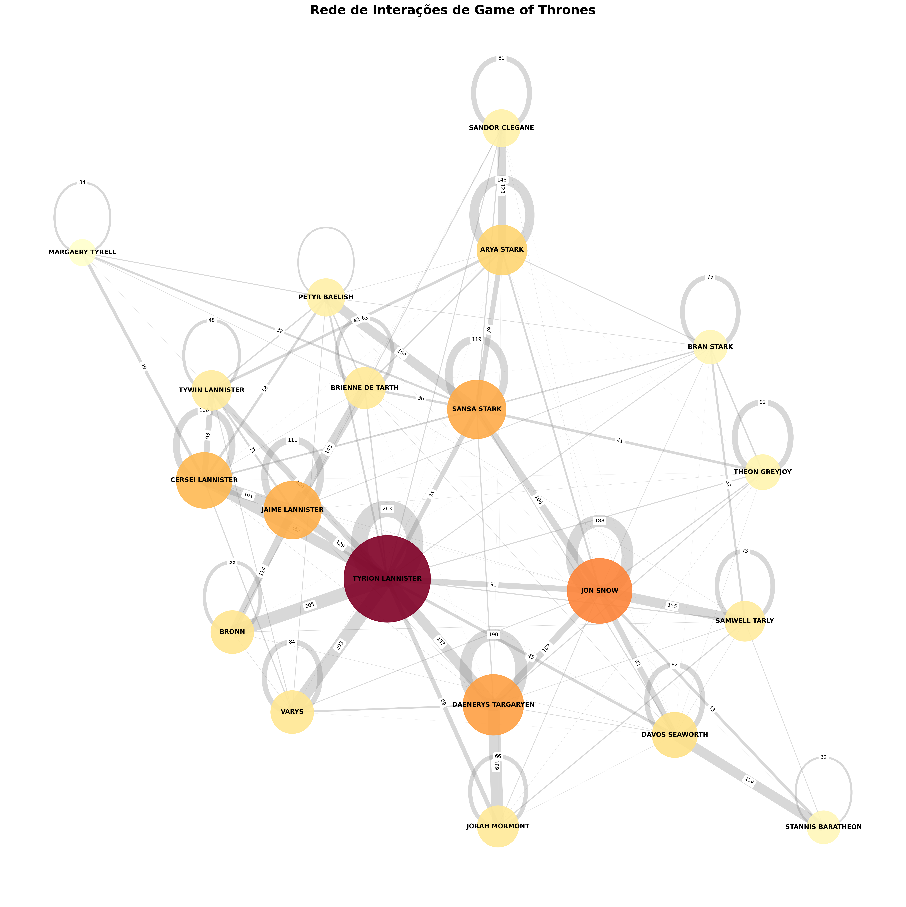

# Game of Thrones - Análise de Interações entre Personagens

Projeto de análise de dados dos scripts de Game of Thrones, gerando datasets de personagens e suas interações ao longo das 8 temporadas.

## 📊 Visualizações dos Grafos

### 📓 **Para visualizar os grafos e análises completas, abra os notebooks:**

```bash
jupyter notebook notebooks/visualizacao_grafos.ipynb
jupyter notebook notebooks/analise_centralidade_final.ipynb
```

### Grafo Top 20 Personagens



**Características:**
- Nós: Tamanho proporcional à importância
- Cores: Gradiente de importância (amarelo → vermelho)
- Arestas: Espessura proporcional à frequência

---

### Grafo Completo com Comunidades Coloridas


**Características:**
- 🎨 **Cores:** Cada cor = uma comunidade diferente
- 📊 **Tamanho:** Proporcional ao peso total de interações
- 🎯 **Algoritmo:** Louvain (detecção automática de comunidades)

---

### Grafo com Comunidades Agrupadas


**Características:**
- 🔵 **Arestas cinzas:** Interações dentro da comunidade
- 🔴 **Arestas vermelhas tracejadas:** Interações entre comunidades
- 🎯 **Layout:** Comunidades dispostas em círculo

---

## 📋 Descrição

Este projeto processa os scripts completos de Game of Thrones para:
- Identificar todos os personagens e contar suas falas
- Mapear variações de nomes e famílias usando IA
- Gerar dataset completo de interações entre personagens
- Criar e visualizar grafos de interações
- Analisar métricas de centralidade e importância

## 🚀 Início Rápido

### 📝 **IMPORTANTE: Visualização dos Resultados**

Para visualizar os grafos e análises completas:

```bash
# Abrir notebook com visualizações dos grafos
jupyter notebook notebooks/visualizacao_grafos.ipynb

# Abrir notebook com análise de centralidade
jupyter notebook notebooks/analise_centralidade_final.ipynb
```

### Pré-requisitos
```bash
# Bibliotecas básicas
pip install pandas requests

# Para visualização de grafos
pip install networkx matplotlib

# Para análise de centralidade
pip install scikit-learn python-louvain
```

### Execução
```bash
# 1. Extrair personagens
python src/01_extrair_personagens.py

# 2. Identificar duplicados e famílias (requer API Key DeepSeek)
python src/02_identificar_duplicados.py

# 3. Gerar interações
python src/03_extrair_interacoes.py

# 4. Criar e visualizar grafo de interações
python src/04_criar_grafo.py

# 5. Gerar grafos completos com comunidades
python src/05_grafo_completo.py

# 6. Análise de centralidade
python src/analise_centralidade.py
```

### 📊 Visualizar Resultados

Após executar os scripts, abra os notebooks para visualizar:

```bash
jupyter notebook notebooks/visualizacao_grafos.ipynb
jupyter notebook notebooks/analise_centralidade_final.ipynb
```

## 📖 Guia Detalhado de Inicialização

### Passo 1: Extrair Personagens

O primeiro passo é extrair todos os personagens dos arquivos de transcrição dos episódios.

**Comando:**
```bash
python src/01_extrair_personagens.py
```

**O que faz:**
- Lê todos os arquivos `.txt` da pasta `genius/` (temporadas s01 a s08)
- Identifica personagens pelo padrão `[NOME]:` (nomes em maiúsculas seguidos de dois pontos)
- Conta o número de falas de cada personagem
- Filtra personagens usando a lista de palavras bloqueadas em `src/bloq.txt`
- Gera o arquivo `datasets/personagens.csv`

**Arquivo de saída:** `datasets/personagens.csv`
- **NOME**: Nome do personagem
- **Status**: `Ativo` ou `Bloqueado`
- **Falas**: Número total de falas do personagem

**Configuração:** Para adicionar ou remover palavras bloqueadas, edite o arquivo `src/bloq.txt` (palavras separadas por vírgula).

---

### Passo 2: Identificar Personagens Duplicados

Identifica personagens com nomes diferentes que são a mesma pessoa (erros de digitação, apelidos, variações).

**Pré-requisito:** Crie o arquivo `src/deepkey.txt` com sua chave da API DeepSeek (apenas a chave, sem espaços ou quebras de linha extras).

**Obtenha sua API Key:** https://platform.deepseek.com/

**Comando:**
```bash
python src/02_identificar_duplicados.py
```

**O que faz:**
- Lê personagens ativos de `datasets/personagens.csv`
- Processa em blocos de 50 nomes (limitação da API)
- Usa DeepSeek para identificar duplicatas e variações
- Salva respostas brutas em `compile/deepseek_bloco_N.txt`
- Mescla resultados pela chave NOME_OFICIAL
- Gera o arquivo `datasets/personagens_dicionario.csv`

**Arquivo de saída:** `datasets/personagens_dicionario.csv`
- **NOME_OFICIAL**: Nome principal/correto do personagem
- **VARIACOES**: Todas as variações do nome (separadas por `|`)
- **FAMILIA_GRUPO**: Casa ou grupo do personagem (ex: Casa Stark, Night's Watch)

---

### Passo 3: Extrair Interações

Extrai todas as interações entre personagens dos episódios.

**Comando:**
```bash
python src/03_extrair_interacoes.py
```

**O que faz:**
- Lê todos os arquivos `.txt` da pasta `genius/`
- Identifica cenas e falas de personagens
- Descarta cenas sem falas
- Em conversas em grupo, cria um registro para cada par falante-ouvinte
- Gera o arquivo `datasets/interacoes.csv`

**Arquivo de saída:** `datasets/interacoes.csv`
- **NTemporada**: Número da temporada
- **NEpisodio**: Número do episódio
- **NCena**: Número da cena
- **falante**: Personagem que fala
- **ouvinte**: Personagem que ouve
- **fala**: Texto da fala
- **tamanho_fala**: Número de caracteres da fala
- **descricao_cena**: Descrição da cena (primeiros 200 caracteres)
- **num_personagens_cena**: Quantidade de personagens na cena
- **tipo_interacao**: `single` (2 personagens) ou `group` (3+ personagens)

---

### Passo 4: Criar e Visualizar Grafo

**Comando:**
```bash
python src/04_criar_grafo.py
```

**O que faz:**
- Cria grafo de interações entre personagens
- Gera visualização dos top personagens
- Salva imagem do grafo

**Visualização do Grafo:**
- **Nós**: Personagens (tamanho = importância por peso de interações)
- **Arestas**: Interações diretas (espessura = frequência)
- **Cores**: Gradiente de importância (amarelo → vermelho)
- **Top 20 personagens** com interações mais significativas

**Personalização:**
```python
G_top = subgrafo_top_personagens(G, 30)  # Top 30 ao invés de 20
visualizar_grafo(G_top, peso_minimo_label=50)  # Mostrar apenas pesos ≥ 50
```

---

## 📁 Estrutura do Projeto

```
got_grafos/
├── genius/                          # Scripts originais (s01-s08)
├── datasets/                        # Datasets gerados
│   ├── personagens.csv             # Lista de personagens
│   ├── personagens_dicionario.csv  # Mapeamento de variações
│   └── interacoes.csv              # Interações entre personagens
├── src/                            # Scripts de processamento
│   ├── 01_extrair_personagens.py   # Extrai personagens
│   ├── 02_identificar_duplicados.py # Identifica variações (IA)
│   ├── 03_extrair_interacoes.py    # Gera interações
│   ├── 04_criar_grafo.py           # Cria e visualiza grafo
│   ├── 05_grafo_completo.py        # Grafos completos com comunidades
│   ├── analise_centralidade.py     # Análise de métricas
│   └── bloq.txt                    # Palavras bloqueadas
├── notebooks/                      # Jupyter notebooks
│   ├── visualizacao_grafos.ipynb   # 📊 Visualização dos grafos
│   └── analise_centralidade_final.ipynb # 🎯 Análise completa
├── saidas/                         # Imagens dos grafos gerados
└── README.md                       # Este arquivo
```

## 🤖 IA - DeepSeek

O projeto usa a API do DeepSeek para:
- Identificar variações de nomes automaticamente
- Classificar personagens por família/grupo
- Reduzir duplicatas e inconsistências

## 🛠️ Troubleshooting

### Erro de conexão DeepSeek
- Verifique conexão com internet
- Confirme API Key válida em `src/deepkey.txt`
- Use DNS público (8.8.8.8)

### KeyError em colunas
- Execute os scripts na ordem correta (01 → 02 → 03 → 04)
- Certifique-se que `datasets/personagens_dicionario.csv` tem colunas: NOME_OFICIAL, VARIACOES, FAMILIA_GRUPO

### Encoding error
- Use UTF-8 em todos os arquivos
- Windows: execute `chcp 65001` no CMD

### Arquivo bloq.txt não encontrado
- Crie o arquivo `src/bloq.txt` com palavras bloqueadas separadas por vírgula

## 📝 Licença

Projeto acadêmico

## 👥 Contribuições

Sugestões e melhorias são bem-vindas!
